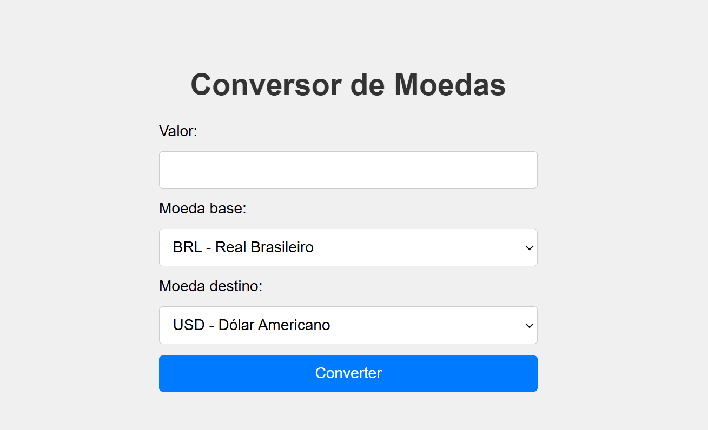

# 💱 Conversor de Moedas

🔗 [🌐 Acesse a versão online aqui](https://conversordemoedas-z2w0.onrender.com)

Um conversor de moedas simples e interativo, desenvolvido com **Node.js**, **Express**, **HTML**, **CSS** e **JavaScript puro**. A aplicação utiliza a **API pública [Frankfurter](https://www.frankfurter.app/)** para buscar taxas de câmbio em tempo real e realiza a conversão diretamente no navegador do usuário.

---

## 📸 Preview



---

## 🚀 Funcionalidades

- 🔁 Conversão entre diversas moedas internacionais (ex: BRL → USD, EUR → JPY)
- ⚡ Consulta automática da taxa de câmbio atual
- 💻 Interface web amigável e responsiva
- ✅ Validação de campos obrigatórios
- 🌐 Aplicação 100% web, sem necessidade de instalação
- 🧠 Backend leve e eficiente com Node.js + Express
- ☁️ Pronto para deploy em plataformas como Render, Railway ou Heroku

---

## 🛠️ Tecnologias e ferramentas utilizadas

| Tecnologia         | Função                                      |
|--------------------|---------------------------------------------|
| **Node.js**        | Ambiente de execução JavaScript no backend  |
| **Express.js**     | Framework leve para servidor HTTP           |
| **Axios**          | Cliente HTTP para requisição à API externa  |
| **HTML5**          | Estrutura da interface                      |
| **CSS3**           | Estilização visual                          |
| **JavaScript (Vanilla)** | Lógica do frontend e requisições       |
| **Frankfurter API**| Fonte das taxas de câmbio                   |

---

## 📂 Estrutura de Diretórios


---

## 🖥️ Como usar o conversor

### ✅ Pré-requisitos

- [Node.js](https://nodejs.org/) instalado
- Terminal com Git (ou CLI)
- Conta em Render, Railway ou Heroku para deploy (opcional)

---

### 🔧 Instalação local

1. Clone o repositório:

```bash
git clone https://github.com/seu-usuario/conversor-moedas.git
cd conversor-moedas
